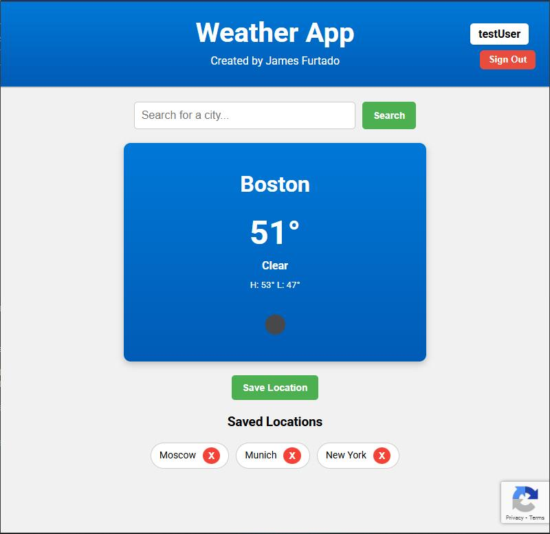

# 🌤️ Weather App - Secure Full Stack Weather Service

My **Weather App** is a full-stack weather forecasting application that allows users to view real-time weather data, save favorite locations, and securely sign up with SMS-based two-factor authentication.

I built this project to strengthen my full-stack development skills — with a focus on React, RESTful API development, real-world security features, and database management.

---

## 💪 Motivation

* Explore full-stack development using React and Spring Boot.
* Build and learn about REST APIs.
* Integrate real-time third-party APIs (OpenWeatherMap).
* Implement secure user authentication with Firebase and 2FA.
* Practice full environment setup with backend, frontend, and database coordination.

---

## ⚙️ Tech Stack

- **Frontend:** React.js
- **Backend:** Java Spring Boot
- **Database:** MySQL
- **Authentication:** Firebase Phone Auth
- **Weather Data:** OpenWeatherMap API

--- 

## 🛠️ Features & Demonstration


### 🌤️ Homepage – Live Weather + Saved Locations

Here is what the homepage looks like!

Users can search any city's weather to get retrieve live forecasting via the OpenWeatherMap API.

Logged-in users can save locations for quick checks later.



---

### 🔐 Secure Authentication

Users sign up with a username, password, and phone number.

The phone number and password are SHA-256 encrypted within the MySQL database.


---

### 📱 Two-Factor Authentication

Upon login/signup, users are sent a verification code via SMS, using Firebase Phone Auth.


*I know, I know-- it isn't that pretty... But it works!*

---

## 📦 Installation and Usage

**Note:** You’ll need API keys from both Firebase and OpenWeatherMap.

### 1. Prerequisites

- Node.js
- Java JDK 17+
- Maven
- MySQL Server + Workbench
- [OpenWeatherMap API Key](https://openweathermap.org/api)
- [Firebase Console Account](https://console.firebase.google.com/)

---

### 2. Clone the Repository

```bash
git clone https://github.com/yourusername/weather-app.git
cd weather-app
```

---

### 3. Database Setup

- Open MySQL Workbench
- Connect to your MySQL server
- Run the SQL script in `/sql/` to initialize schema and tables

---

### 4. Firebase Setup (Phone Auth)

1. Create a new project in Firebase Console  
2. Enable Phone Authentication  
3. Add a web app to retrieve credentials  
4. Generate a service account JSON file  
5. Save it as:

```bash
backend/firebase.json
```

6. Update your backend `.env` file with required credentials (see `.env.example`)

---

### 5. Backend Setup

```bash
cd backend
mvn spring-boot:run
```

- App runs on: http://localhost:8080

---

### 6. Frontend Setup

```bash
cd frontend
npm install
```


```bash
npm start
```

- Frontend runs on: http://localhost:3000

---

### 🧪 Usage

- Open the frontend URL
- Sign up with a phone number
- Enter the SMS code
- Search any city for weather
- Save locations to your account

---

## 👤 Author

James Furtado  
[jamesdfurtado@gmail.com](mailto:jamesdfurtado@gmail.com)  
[linkedin.com/in/james-furtado](https://linkedin.com/in/james-furtado)

